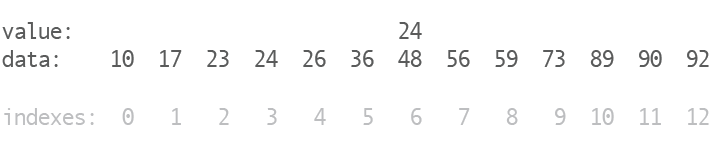

# Algorithm Practice: Binary Search

Recursive binary search algorith.

This method will function without relying on Ruby's built in `Array` and `Enumerable` methods.  The only method we may call on the array we're searching is `Array#length`.

### Linear Search

In a linear search we look at one item at a time. The bigger the array, the more comparisons our program needed to make as it searched for what it was looking for. Another way of saying this is that the relationship between the size of the array and the number of operations your program has to make is _linear_ since they increase in lock step.

Linear searches are very useful and very simple, but imagine an array with a million elements. In the worst case scenario, you might be searching for the item at the end of that long array. A linear search will need to make 999,999 checks before it finally gets to that last item!

Could there be a better way?

### More Efficient Searching

To make things interesting, let's consider searching through a large list of items that's already sorted. Dictionaries are a great example of a sorted data set. We could have thousands of words in a single dictionary, all sorted alphabetically. If you had to look up a word in a dictionary, how would you do it?

If you were a linear search you would start on page 1 in the "A's" and work your way forward until you found your result. In practice, though, we never do that.

A more common approach is to flip the dictionary open somewhere in the middle and figure out if we need to then continue searching left or right. If we're looking for the word "Golden" and the page we open to has the word "Lettuce" we know we need to head left because "G" comes before "L".

If we're searching to the left then we will ignore the right half of the dictionary and split the left half somewhere in the middle. This time we might land in the "F's" meaning we need to search right. If we keep this up we'll eventually find our word, or find that it isn't in the dictionary at all.

Reflect on what's happening here. How does this approach stack up against the linear search? Which would be faster? If the linear search's relationship to the size of the array is linear, is the same true of our approach?

### Binary Search

The dictionary search strategy we're describing above is really a _binary search_. It's "binary" because every time you open the dictionary and decide to go left or right you have a _binary choice_. That binary choice means our "search space" reduces by half with every step. This is in stark contrast to the one-at-a-time approach that linear search offers us.

If you we were to describe our binary search approach in pseudocode, it might look like this:

 1. Pick a point in the middle
 1. Compare what we find in the middle to what we're searching for
 1. If we found what we're looking for, we're done!
 1. If we didn't find what we're looking for, pick the left or right half to keep searching
 1. Apply the same process to our new half

Here's an animation of us doing just that to a list of sorted numbers:

